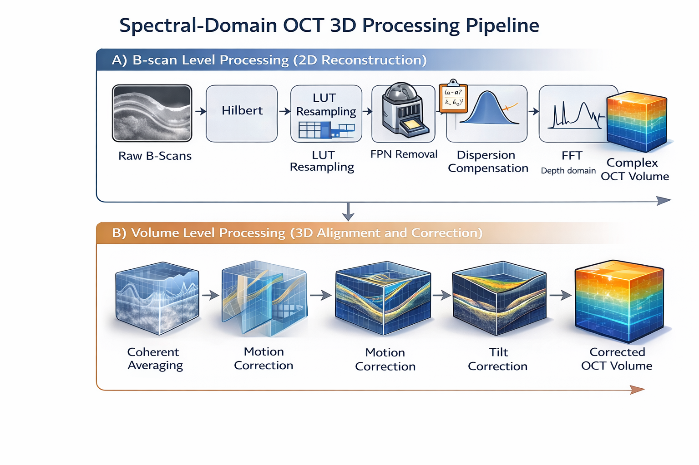

# Spectral-Domain OCT 3D Pipeline

This repository implements a **full spectral-domain OCT processing pipeline** for **B-scan reconstruction and 3D volume formation**.  
The pipeline covers both **2D (B-scan level)** and **3D (volume level)** processing, including dispersion compensation, coherent averaging, motion correction, and tilt correction.

The focus of this project is on **signal-processing correctness, physical interpretation, and volume consistency**, rather than hardware-specific acquisition details.  
A more detailed technical description of the pipeline, including mathematical background and design rationale, is provided in the accompanying **`OCT Pipeline.pdf`**.

---

## Pipeline Overview

The processing chain is organized into two main stages:

1. **B-scan level processing (2D reconstruction from raw spectra)**
2. **Volume level processing (3D alignment and correction across frames and volumes)**

A high-level overview of the pipeline is shown below.

---

## A) B-scan Level Processing (2D Reconstruction)

### 1. Acquisition parameter parsing

Acquisition metadata is read to determine the structure of the dataset:
- `numPoints`: spectral samples per A-scan  
- `numAscans`: A-scans per B-scan  
- `numBscans`: B-scans per volume  
- `numCscans`, `numMscans`: system-specific scan dimensions  

Key processing parameters are initialized, including:
- dispersion model order
- coefficient search range
- reference frame index (middle B-scan)

---

### 2. Raw data loading and analytic signal formation

Raw spectral data from a reference B-scan is loaded and converted to a complex analytic signal using a Hilbert transform:

- real-valued interferogram → complex spectral signal

This enables subsequent phase-sensitive processing steps.

---

### 3. k-linearization using LUT-based resampling

The raw spectral data is resampled to a **uniform wavenumber (k) grid** using a calibration lookup table (LUT).  
This step is required to ensure valid FFT-based depth reconstruction.

---

### 4. Fixed-pattern noise (FPN) removal

To suppress spectrometer-dependent background structure, the **median complex spectrum across A-scans** is subtracted from each A-scan:

- median(real) and median(imag) are computed independently  
- subtraction is performed per depth sample  

This removes fixed-pattern background while preserving structural information.

---

### 5. Spectral apodization (Hann window)

A Hann window is applied along the k-direction to reduce spectral leakage and sidelobes in the depth domain prior to FFT.

---

### 6. Dispersion coefficient estimation (reference B-scan)

Dispersion mismatch is estimated from a **single reference B-scan** (typically the middle frame).  
A polynomial phase model in wavenumber is fitted within a selected depth ROI to determine dispersion coefficients.

These coefficients maximize axial sharpness after FFT-based reconstruction.

---

### Dispersion Compensation Applied to the Full Volume

The estimated dispersion coefficients are applied **uniformly to all B-scans in the volume**, ensuring consistent axial resolution and phase behavior throughout the dataset.

---

### 7. FFT-based depth reconstruction

After dispersion compensation:
- FFT is applied along the k-dimension
- the usable depth range is cropped
- reconstructed B-scans are stored as a complex-valued volume

Each reconstructed volume is saved for subsequent volume-level processing.

---

## B) Volume Level Processing (3D Alignment and Correction)

### 8. Phase-corrected coherent averaging across volumes

Multiple reconstructed volumes are coherently averaged to improve SNR.

- The first volume is used as a **phase reference**
- For each additional volume:
  - a **bulk phase offset** is estimated per A-scan using the product with the conjugate reference
  - the phase offset is removed
  - the phase-aligned volume is added to the running average

This is **coherent (phase-aligned) averaging**, not magnitude averaging.

---

### Motion Artifacts Across B-scans

During volumetric acquisition, inter-frame motion can introduce axial misalignment between consecutive B-scans.  
If uncorrected, this motion degrades volume consistency and limits the effectiveness of coherent averaging.

---

### 9. Motion correction (slow-scan direction)

Each B-scan is registered to the **middle B-scan** of the volume using Fourier-domain shift estimation:

- 2D FFTs of reference and target B-scans are computed
- axial shifts are estimated using `dftregistration_vol`
- integer-pixel alignment is applied using `circshift`

This produces a motion-corrected volume.

---

### 10. Subpixel motion refinement

A subpixel motion correction routine is applied to refine alignment accuracy beyond integer shifts, resulting in improved axial consistency across the volume.

---

### Tilt Artifacts in OCT Volumes

Tilt artifacts can occur along both the **slow-scan (B-scan)** and **fast-scan (A-scan)** directions, producing systematic depth misalignment across the volume.

---

### 11. Tilt correction along the fast-scan direction

Tilt along the fast-scan direction is corrected by:
- registering each A-scan line to the middle line using Fourier-based registration
- applying integer axial shifts via `circshift`

---

### 12. Subpixel tilt correction with axis permutation

To perform subpixel correction along the fast-scan direction:
- the volume is permuted so the correction routine operates along the intended axis
- subpixel motion correction is applied
- the volume is permuted back to its original orientation

This step ensures consistent axial alignment across both scan directions.

---

## Notes

- Dispersion coefficients are estimated once from a reference B-scan and reused across the full volume.
- Coherent averaging relies on per-A-scan bulk phase correction.
- Motion and tilt corrections are based on Fourier-domain registration followed by integer and subpixel refinement.
- Detailed function behavior is documented in the accompanying PDFs.

---

## Detailed Documentation

A detailed technical description of the OCT processing pipeline, including mathematical background, design rationale, and step-by-step explanations, is provided in:

- **`OCT Pipeline.pdf`**

This document complements the README by offering deeper insight into the signal processing methods and implementation details used throughout the pipeline.

---
## 🧑‍💻 Author

**Arman Rajaei**
